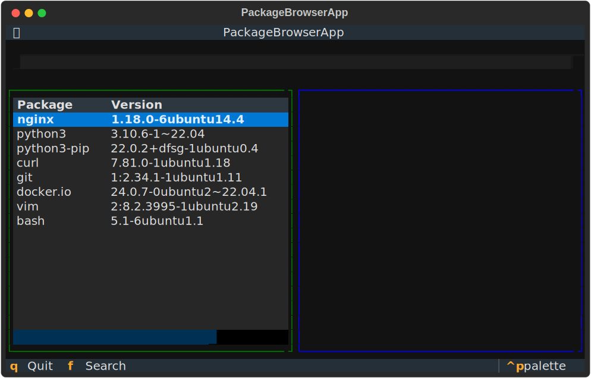

# apt-registry-explorer

A Python utility to validate and explore APT registry endpoints to check for available distributions, channels, and packages without needing the apt-source set up, or root access.

**Requirements:** Python 3.11 or higher

## Features

- **Interactive Discovery**: Navigate APT repository URLs interactively to discover distributions, architectures, and components
- **TUI Package Browser**: Terminal user interface with fzf-style package browsing and split-pane information display
- **CLI Tools**: Command-line interface built with Typer for querying packages with JSON output similar to apt-cache
- **APT Sources Builder**: Generate apt.sources configuration files with GPG/arch/signed-by options
- **Modern Python**: Uses Python 3.11+ features including built-in generics, match-case statements, and pipe unions

## Terminal UI (TUI) Preview

The interactive TUI provides a split-pane interface for browsing packages:



_Split-pane package browser with real-time search and detailed package information_

## Installation

### For Users

```bash
# Using uv (recommended)
uv tool install apt-registry-explorer

# Or using pip
pip install apt-registry-explorer
```

**Note:** Requires Python 3.11 or higher.

### Development Installation with uv (Recommended)

This project uses [uv](https://docs.astral.sh/uv/) from Astral for fast, reliable dependency management.

```bash
# Install uv (recommended method from official docs)
curl -LsSf https://astral.sh/uv/install.sh | sh

# Clone the repository
git clone https://github.com/Jamie-BitFlight/apt-registry-explorer.git
cd apt-registry-explorer

# Sync all dependencies (installs project + dev dependencies)
uv sync

# Run tests
uv run pytest

# Run the CLI
uv run apt-registry-explorer --help
```

### Alternative Installation with pip

```bash
# Clone the repository
git clone https://github.com/Jamie-BitFlight/apt-registry-explorer.git
cd apt-registry-explorer

# Install with pip
pip install -e ".[dev]"
```

## Dependencies

This project uses modern Python frameworks:

- **Typer** (>=0.21.0) - For the CLI interface (includes Rich for formatting)
- **Textual** (from textualize.io) - For the TUI package browser
- **httpx** (>=0.27.0) - For async HTTP requests
- **Pydantic** (>=2.0.0) - For data validation and parsing
- **uv** (from Astral) - For dependency management (dev workflow)

Note: Rich is included with Typer and does not need to be installed separately.

## Usage

### Interactive Discovery

Explore a repository structure and generate sources configuration:

```bash
apt-registry-explorer discover https://example.com/debian
```

This will:

- List available directories
- Find distribution suites
- Display architectures and components
- Generate apt.sources configuration

### CLI Query

Query packages from a repository:

```bash
# List available architectures
apt-registry-explorer query --source https://example.com/debian --list-arch

# Query packages for a specific architecture
apt-registry-explorer query --source https://example.com/debian --arch amd64 --package python3

# Search with regex pattern
apt-registry-explorer query --source https://example.com/debian --arch amd64 --regex "^python3-.*"

# Filter by version
apt-registry-explorer query --source https://example.com/debian --arch amd64 --package python3 --version ">=3.9"

# Use a deb line as source
apt-registry-explorer query --source "deb https://example.com/debian stable main" --arch amd64 --package nginx
```

### TUI Package Browser

Launch the interactive terminal UI to browse packages with keyboard navigation and real-time search:

```python
from apt_registry_explorer.packages import PackageIndex
from apt_registry_explorer.tui import PackageBrowserApp

# Load packages from repository
index = PackageIndex()
index.load_from_url("https://example.com/debian", "amd64", "main")

# Launch TUI
app = PackageBrowserApp(index.get_all_packages())
app.run()
```

**TUI Features:**

- **Split-pane interface**: Package list on the left, detailed information on the right
- **Real-time search**: Type `/` or `f` to focus search, filter packages as you type
- **Keyboard navigation**: Arrow keys to navigate, Enter to select, `q` to quit
- **Package details**: View dependencies, description, maintainer, homepage, and more
- **Colorized output**: Syntax-highlighted package information

**Keyboard Shortcuts:**

- `/` or `f` - Focus search box
- `↑`/`↓` - Navigate package list
- `Enter` - Select package to view details
- `q` - Quit application

## Command-Line Options

### `discover` Command

```
Usage: apt-registry-explorer discover [OPTIONS] URL

  Interactively discover repository structure and generate sources configuration.

Options:
  --format [deb822|oneline]  Output format (default: deb822)
  --help                     Show this message and exit.
```

### `query` Command

```
Usage: apt-registry-explorer query [OPTIONS]

  Query APT repository for package information.

Options:
  --source TEXT               Repository URL or deb line [required]
  --list-arch                 List available architectures
  --arch TEXT                 Architecture to query (e.g., amd64)
  --package TEXT              Package name to search
  --version TEXT              Version specification (e.g., >=1.0)
  --regex TEXT                Regex pattern to match package names
  --component TEXT            Component to query (default: main)
  --output [json|text]        Output format (default: json)
  --help                      Show this message and exit.
```

## Output Format

The tool outputs package metadata in JSON format similar to apt-cache:

```json
[
  {
    "package": "python3",
    "version": "3.11.2-1",
    "architecture": "amd64",
    "maintainer": "Example Maintainer <maintainer@example.com>",
    "installed_size": "1024",
    "depends": "python3-minimal (= 3.11.2-1)",
    "section": "python",
    "priority": "important",
    "description": "Interactive high-level object-oriented language",
    "filename": "pool/main/p/python3/python3_3.11.2-1_amd64.deb",
    "size": "2048",
    "sha256": "abc123..."
  }
]
```

## Development

### Running Tests

```bash
# With uv
uv run pytest

# Or with installed pytest
pytest
```

### Code Formatting and Linting

```bash
# Format code with ruff
ruff format packages/apt-registry-explorer/src tests

# Lint code
ruff check packages/apt-registry-explorer/src tests

# Type checking with mypy
mypy packages/apt-registry-explorer/src

# Type checking with basedpyright
basedpyright packages/apt-registry-explorer/src
```

## License

MIT License - see LICENSE file for details.

## Contributing

Contributions are welcome! Please feel free to submit a Pull Request.
